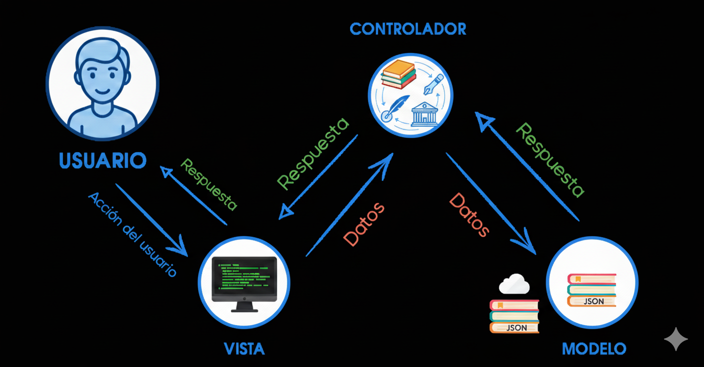
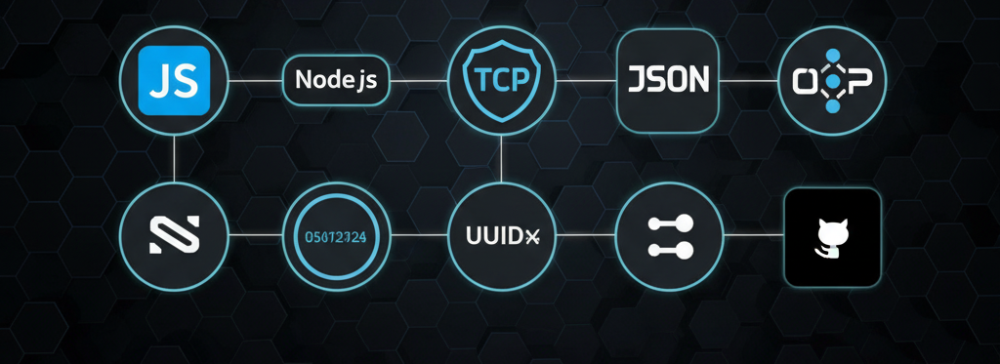
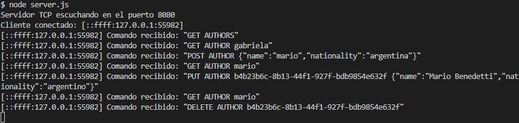
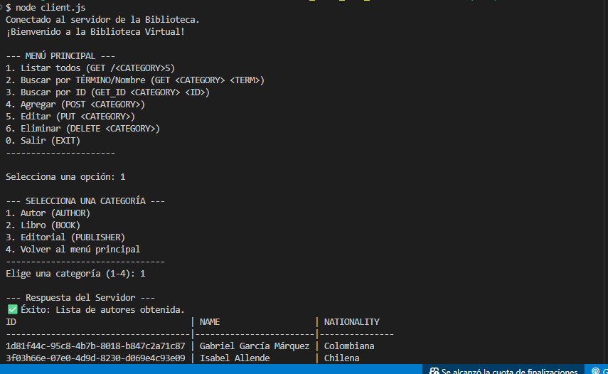

<div align="center">
  
</div>

<h2 align="center">
📚 Proyecto Final <span style="font-size:1.2rem; font-weight:bold;">Back End</span> 📚 <br>
Desafío Integrador: API de Gestión de Biblioteca
</h2>

<h1 align="center" style="font-size:3rem; font-weight:bold;">Aplicación de Consola con Arquitectura MVC</h1>

<div align="center">
  <!-- 👉 Acá podés insertar imágenes de presentación del proyecto -->
  
</div>

REPOSITORIO REALIZADO GRUPALMENTE, EN EL GITHUB DE ANTONELA BORGOGNO, DONDE SE PUEDEN VER LAS RAMAS CREADAS PARA EL DESARROLLO DEL TRABAJO FINAL.
---

### 📑 Índice
- [📌 Descripción](#-descripción)
- [✨ Características principales](#-características-principales)
- [🧠 Arquitectura del proyecto](#-arquitectura-del-proyecto)
- [🛠️ Tecnologías utilizadas](#️-tecnologías-utilizadas)
- [📂 Estructura de archivos](#-estructura-de-archivos)
- [🚀 Instalación y configuración](#-instalación-y-configuración)
  - [📌 Prerrequisitos](#-prerrequisitos)
  - [🧭 Pasos](#-pasos)
    - [1. Clonar el repositorio](#1-clonar-el-repositorio)
    - [2. Entrar a la carpeta del proyecto](#2-entrar-a-la-carpeta-del-proyecto)
    - [3. Instalar dependencias](#3-instalar-dependencias)
- [🏃 Modo de uso](#-modo-de-uso)
  - [1️⃣ Servidor](#1️⃣-servidor)
    - [o](#o)
    - [👉 Aparecerá el mensaje:](#-aparecerá-el-mensaje)
  - [2️⃣ Cliente](#2️⃣-cliente)
    - [👉 Se desplegará el menú principal interactivo.](#-se-desplegará-el-menú-principal-interactivo)
- [📝 Ejemplos de uso](#-ejemplos-de-uso)
    - [➕ Agregar un nuevo autor](#-agregar-un-nuevo-autor)
    - [✏️ Editar un libro](#️-editar-un-libro)
- [🧪 Pruebas automatizadas](#-pruebas-automatizadas)
  - [1. Asegurate de que el servidor esté corriendo](#1-asegurate-de-que-el-servidor-esté-corriendo)
  - [2. Ejecutá las pruebas en otra terminal](#2-ejecutá-las-pruebas-en-otra-terminal)
- [👥 Autores](#-autores)

---

## 📌 Descripción

Este proyecto es una **aplicación de consola completa** desarrollada en **Node.js**, que permite gestionar autores, libros y editoriales a través de un **servidor TCP** y un **cliente interactivo**.  

La API sigue el patrón **Modelo–Vista–Controlador (MVC)** para mantener un código organizado, escalable y fácil de mantener.  
Todas las operaciones se realizan desde la terminal, mediante un sistema de menús intuitivo que elimina la necesidad de escribir comandos manuales.

<a href="#-índice">⬆️ Volver al índice</a>

---

## ✨ Características principales

- 🧭 **Interfaz de consola interactiva** para navegar por menús numéricos.  
- 📝 **Gestión CRUD completa** para Autores, Libros y Editoriales.  
- 💾 **Persistencia de datos** en archivos `.json` locales.  
- 🔍 **Búsqueda parcial e insensible a mayúsculas**.  
- 🔗 **Manejo de relaciones** entre autores, libros y editoriales.  
- 🧠 **Separación clara de capas (MVC)** para facilitar el mantenimiento.  
- 🧪 **Script de pruebas automatizado** para validar las operaciones principales.

<a href="#-índice">⬆️ Volver al índice</a>

---

## 🧠 Arquitectura del proyecto

El proyecto utiliza la arquitectura **MVC**, separando claramente las responsabilidades:

- **Modelos (`models/`)** → Gestionan la lectura y escritura de datos JSON.  
- **Vistas (`views/`)** → Formatean las respuestas para mostrarlas en la terminal.  
- **Controladores (`controllers/`)** → Contienen la lógica de negocio y coordinan la interacción entre modelos y vistas.  
- **Servidor (`server.js`)** → Escucha conexiones TCP y enruta las peticiones.  
- **Cliente (`client.js`)** → Proporciona el menú interactivo para el usuario final.

Además, se implementa un **enfoque DRY** a través de una **fábrica de modelos genérica**, que centraliza la lógica CRUD y evita duplicaciones.

<a href="#-índice">⬆️ Volver al índice</a>

---

## 🛠️ Tecnologías utilizadas

<div align="center">
  <!-- 👉 Acá podés insertar imágenes de presentación del proyecto -->
  
</div>

| JavaScript | Node.js | TCP (Net Module) | Console I/O (Readline) | JSON | OOP (POO) | UUID | Git | GitHub |
|:---:|:---:|:---:|:---:|:---:|:---:|:---:|:---:|:---:|
|  |  |  |  |  |  |  |  |  |

<a href="#-índice">⬆️ Volver al índice</a>

---

## 📂 Estructura de archivos

```bash
📁 book-api
├── 📂 data
│   ├── authors.json
│   ├── books.json
│   └── publishers.json
├── 📂 src
│   ├── 📂 controllers
│   │   ├── authorsController.js
│   │   ├── booksController.js
│   │   └── publishersController.js
│   ├── 📂 models
│   │   ├── authorsModel.js
│   │   ├── booksModel.js
│   │   ├── createDataModel.js
│   │   └── publishersModel.js
│   └── 📂 views
│       └── responseFormatter.js
├── .gitignore
├── client.js
├── server.js
├── test.js
├── package.json
├── package-lock.json
└── README.md
```

<a href="#-índice">⬆️ Volver al índice</a>

---

## 🚀 Instalación y configuración
### 📌 Prerrequisitos
```bash
Node.js  v18+

npm (incluido con Node.js)
```

### 🧭 Pasos
#### 1. Clonar el repositorio
```bash
git clone https://github.com/Antonela89/book-api-ADA
```

#### 2. Entrar a la carpeta del proyecto
```bash
cd book-api
```

#### 3. Instalar dependencias
```bash
npm install
```

<a href="#-índice">⬆️ Volver al índice</a>

---

## 🏃 Modo de uso

Para ejecutar el proyecto se necesitan dos terminales:

### 1️⃣ Servidor
```bash
npm start
```
#### o
```bash
node server.js
```

#### 👉 Aparecerá el mensaje:
```bash
Servidor TCP escuchando en el puerto 8080
```

### 2️⃣ Cliente
```bash
node client.js
```

#### 👉 Se desplegará el menú principal interactivo.

<div align="center">
  <!-- 👉 Acá podés insertar imágenes de presentación del proyecto -->
  
  <p>Terminal del SERVER</p>
  
  <p>Terminal del CLIENT</p>
</div>

<a href="#-índice">⬆️ Volver al índice</a>

---

## 📝 Ejemplos de uso

#### ➕ Agregar un nuevo autor
```bash
En el menú principal, elegí 3 (Agregar).

Seleccioná 1 (Autor).

Ingresá el nombre y la nacionalidad.

Recibirás una confirmación con el nuevo ID.
```

#### ✏️ Editar un libro
```bash
Buscá el libro (2 → Buscar → Libro).

Copiá el ID que te devuelve la tabla.

Volvé al menú y seleccioná 4 → Editar → Libro.

Pegá el ID y modificá los campos deseados.
```

<a href="#-índice">⬆️ Volver al índice</a>

---

## 🧪 Pruebas automatizadas

Incluye un script que ejecuta automáticamente el ciclo CRUD para verificar la API.

### 1. Asegurate de que el servidor esté corriendo
```bash
npm start
```
### 2. Ejecutá las pruebas en otra terminal
```bash
node test.js
```
<a href="#-índice">⬆️ Volver al índice</a>

---

## 👥 Autores
<p align="rigth"> <strong>BORGOGNO, Antonela</strong> 
</p> <p align="center"> <a href="https://github.com/Antonela89" target="_blank">  </a> &nbsp;&nbsp; <a href="https://www.linkedin.com/in/antonela-borgogno/" target="_blank">  </a> &nbsp;&nbsp; <a href="https://discord.com/users/702167403689279578" target="_blank">  </a> &nbsp;&nbsp; <a href="mailto:antoborgogno@gmail.com">  </a> </p> 
<p align="rigth"> <strong>MARTINEZ, Gabriela</strong> 
</p> <p align="center"> <a href="https://github.com/magamahe" target="_blank">  </a> &nbsp;&nbsp; <a href="https://linkedin.com/in/magamahe" target="_blank">  </a> &nbsp;&nbsp; <a href="https://discord.com/users/1143961509505019904" target="_blank">  </a> &nbsp;&nbsp; <a href="mailto:magamahe@gmail.com">  </a> </p>
